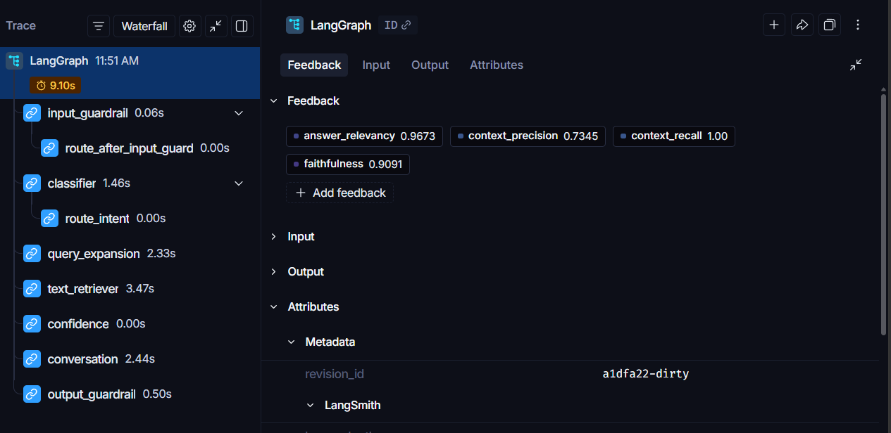

# MechAI — Automotive Service Intelligence

A production-grade RAG agent for BMW service manual Q&A. Built with LangGraph, FastAPI, and a React frontend. Supports dual user modes (Owner and Technician), multi-turn conversation, confidence scoring, and guardrails.

**Live Demo:** [https://project1-automotive-service-rag-age.vercel.app](https://project1-automotive-service-rag-age.vercel.app)

**Backend API:** [https://mechai-backend.delightfulsea-af823488.centralindia.azurecontainerapps.io](https://mechai-backend.delightfulsea-af823488.centralindia.azurecontainerapps.io)

---

## Capabilities

- Ingest 460-page BMW service manual (text) into ChromaDB
- Dual user modes — Owner (plain language) and Technician (full technical detail)
- Multi-turn conversation with token-aware history trimming
- Parallel query classification and query expansion
- Confidence scoring via ChromaDB cosine distance
- Page-level citations on every answer
- Input and output guardrails (prompt injection, profanity, greetings, off-topic)
- Semantic response caching for repeated/similar queries
- RAGAS-evaluated pipeline with LangSmith tracing
- Rate limited API (5 requests/minute per IP)

---

## Pipeline Flow

```text
User Query
  → Input Guardrail           (injection detection, profanity, greeting handler)
  → Semantic Cache Check      (cosine similarity > 0.95 → early return)
  → Classifier + Query Expansion (parallel)
      Classifier              (intent: text / unknown)
      Query Expansion         (query variations via GPT-4o)
  → Text Retriever            (ChromaDB cosine similarity, k=5, deduped)
  → Confidence Scoring        (distance-based threshold: 0.7)
  → Conversation              (GPT-4o, token-aware history, page citations)
  → Output Guardrail          (safety check on generated answer)
  → Response

  classifier (unknown intent) → Unknown Handler → END
```

---

## Architecture

```text
┌─────────────────────────────────────────────────────┐
│                   React Frontend                     │
│            (Vite + Tailwind, Vercel)                 │
└──────────────────────┬──────────────────────────────┘
                       │ HTTPS POST /query
┌──────────────────────▼──────────────────────────────┐
│                 FastAPI Backend                      │
│            (Docker, Azure Container Apps)            │
│                                                      │
│  ┌─────────────────────────────────────────────┐    │
│  │         LangGraph Agent                      │    │
│  │                                              │    │
│  │  input_guardrail                             │    │
│  │       → check_cache                          │    │
│  │       └── classifier       ──┐               │    │
│  │       └── query_expansion ──► text_retriever │    │
│  │                              → confidence    │    │
│  │                              → conversation  │    │
│  │                              → output_guardrail   │    │
│  │       └── unknown_handler → END              │    │
│  └─────────────────────────────────────────────┘    │
│                                                      │
│  ┌──────────────┐  ┌─────────────┐  ┌───────────┐  │
│  │  ChromaDB    │  │ Cosmos DB   │  │ ChromaDB  │  │
│  │ (BMW_RAG_db) │  │ (sessions)  │  │ (cache)   │  │
│  └──────────────┘  └─────────────┘  └───────────┘  │
│                                                      │
│  ┌────────────┐                                      │
│  │  LangSmith │                                      │
│  │  Tracing   │                                      │
│  └────────────┘                                      │
└─────────────────────────────────────────────────────┘
```

---

## RAGAS Evaluation

Pipeline quality evaluated using [RAGAS](https://docs.ragas.io/) on a synthetic test set generated from BMW manual chunks.

| Metric             | Score |
|--------------------|-------|
| Faithfulness       | 0.82  |
| Answer Relevancy   | 0.92  |
| Context Precision  | 0.81  |
| Context Recall     | 1.00  |

Scores are posted as feedback to LangSmith traces via `scripts/evaluate.py`.

---

## LangSmith Tracing

Every pipeline run is traced in LangSmith with per-run RAGAS feedback scores attached.



---

## Folder Structure

```text
deploy/
  api/
    app.py                  — FastAPI entry point, rate limiting, session management
  agent/
    graph.py                — LangGraph graph definition
    classifier.py           — Intent classification (text / unknown)
    query_expansion.py      — GPT-4o query variation generation
    retrievers.py           — ChromaDB text retriever
    semantic_cache.py       — ChromaDB-backed semantic response cache
    confidence_score.py     — Distance-based confidence scoring
    conversation.py         — GPT-4o response generation with token-aware history
    input_guardrail.py      — Input safety checks + greeting handler
    output_guardrail.py     — Output safety checks
    unknown_handler.py      — Out-of-scope query handler
    state.py                — LangGraph AgentState definition
  config/
    settings.py             — Centralized config (models, thresholds, limits)
  frontend/
    src/
      api/client.js         — Fetch client to Azure backend
      hooks/useChat.js      — Session management, message state
      components/
        ModeSelect.jsx      — Owner / Technician mode selection screen
        Sidebar.jsx         — Mode label, recent conversations, FAQ, new conversation button
        MessageBubble.jsx   — Chat bubbles, confidence badge, citations
        InputBar.jsx        — Textarea, 500 char counter, send button
      App.jsx               — Layout, typing indicator, cold start warning
  scripts/
    loader.py               — PDF text extraction via PyMuPDF
    chunker.py               — Text chunking (2000 chars, 200 overlap)
    vector_store.py         — ChromaDB collection builder
    ingest.py               — Full ingestion pipeline runner
    generate_testset.py     — Synthetic Q&A pair generation for RAGAS
    evaluate.py             — RAGAS evaluation + LangSmith feedback posting
    testset.json            — Generated Q&A pairs from BMW manual
    ragas_results.json      — Final RAGAS scores
  Dockerfile
  requirements.txt
```

---

## Key Design Decisions

**Parallel classifier + query expansion** — both nodes run simultaneously after the semantic cache check, cutting latency significantly on cache misses.

**Semantic response caching** — repeated or near-duplicate queries (cosine similarity > 0.95) return a cached response immediately, skipping the full pipeline.

**Token-aware history trimming** — tiktoken counts tokens before each LLM call; oldest message pairs are dropped when approaching the token limit, keeping costs predictable on the free tier.

**Session separation by user type** — session key is `session_id_user_type`, so Owner and Technician histories never bleed into each other.

**Distance-based confidence scoring** — ChromaDB cosine distance is converted to a 0–1 confidence score. Answers below the 0.7 threshold include a verification warning.

**Azure Cosmos DB session storage** — conversation history persists across redeploys and restarts, stored as serialized LangChain messages in Cosmos DB free tier.

**Rate limiting** — slowapi limits incoming API requests to 5 per minute per IP to prevent abuse and protect OpenAI credit usage.

---

## Tech Stack

| Layer | Technology |
|---|---|
| Orchestration | LangGraph |
| LLM | GPT-4o |
| Embeddings | text-embedding-3-small |
| Vector Store | ChromaDB |
| PDF Parsing | PyMuPDF |
| API | FastAPI + slowapi |
| Observability | LangSmith |
| Evaluation | RAGAS |
| Containerization | Docker |
| Backend Deployment | Azure Container Apps (Central India) |
| Frontend | React + Vite + Tailwind + react-markdown |
| Frontend Deployment | Vercel |
| Session Storage | Azure Cosmos DB (free tier, Central India) |
| Container Registry | Azure Container Registry |

---

## Environment Variables

```text
OPENAI_API_KEY=
CHROMA_DB_PATH=./BMW_RAG_db
LANGCHAIN_TRACING_V2=true        # enables automatic LangSmith trace collection
LANGCHAIN_ENDPOINT=https://api.smith.langchain.com
LANGCHAIN_API_KEY=
LANGCHAIN_PROJECT=automotive-service-rag-agent
COSMOS_CONNECTION_STRING=        # Azure Cosmos DB connection string
```